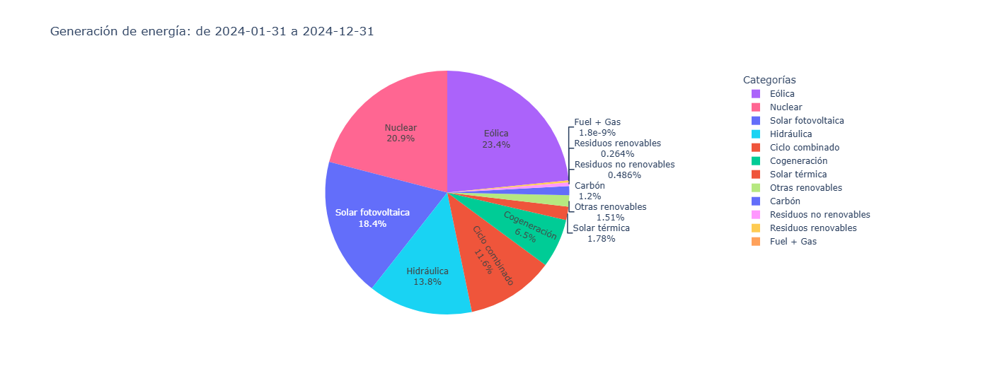

# Análisis de la Red Eléctrica Española

Este proyecto obtiene datos sobre la demanda y consumo eléctrico en España a partir de una API. Permite representar gráficamente la evolución del megavatio y otros indicadores en función de la fecha proporcionada por el usuario.

## Tecnologías utilizadas

-   **Python**
    
-   **Jupyter Notebook**  (.ipynb)
    
-   **Requests** (para llamadas a la API)
    
-   **Pandas** (para procesamiento de datos)
    
-   **Plotly** (para visualización de datos de forma dinámica)
    

## Instalación y uso

### Opción 1: Ejecutar en Google Colab (Recomendado)

Puedes ejecutar este proyecto directamente en Google Colab sin necesidad de instalar nada. Solo abre el siguiente enlace:

[](https://colab.research.google.com/drive/1qtuq8nm4KpksQfFAQGP2mK2-wtukkADT)

Para hacer uso de la utilidad solo hay que hacer CTRL+F9.

### Opción 2: Ejecutar localmente

1.  Clonar este repositorio:
    
    ```bash
    git clone https://github.com/TU-USUARIO/analisis-red-electrica.git
    cd analisis-red-electrica
    
    ```
    
2.  Instalar dependencias:
    
    ```bash
    pip install -r requirements.txt
    
    ```
    
3.  Abrir el notebook en Jupyter:
    
    ```bash
    jupyter notebook
    
    ```
    
4.  Ejecutar el archivo `estudio_see.ipynb`.
    

## Ejemplo de resultado
```


```

## Notas

-   Asegúrate de tener conexión a Internet para que el script pueda realizar la llamada a la API